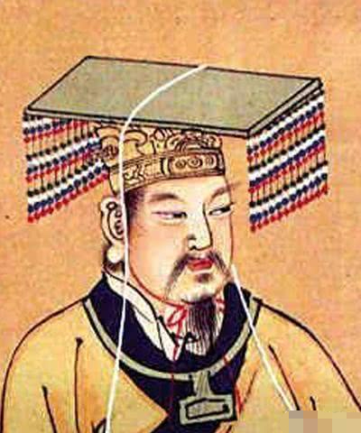

* Just knowing how to use github page can allow you launch an online coure -> something trivial to you might be precious to others 

* You'll be fine if you don't watch/read news.

* No need to answer unknown call.

* The reason why emperor wears crown with tassels is to warn the emperor not to shake their head. Shaking your head unconsciously harm your dignity.

* Identify the extreme individual in a group, manipulate and exaggerate them to affect the entire group -> "Mindf*ck: Cambridge Analytica and the Plot to Break America"

* Just looking at your posture the hunters know whether you're a good pery -> "The Wisdom of Psychopaths"

* How did Ichiro Suzuki throw so fast? Soft muscle.

* Advanced pianist sight-read via pattern instead of note by note.